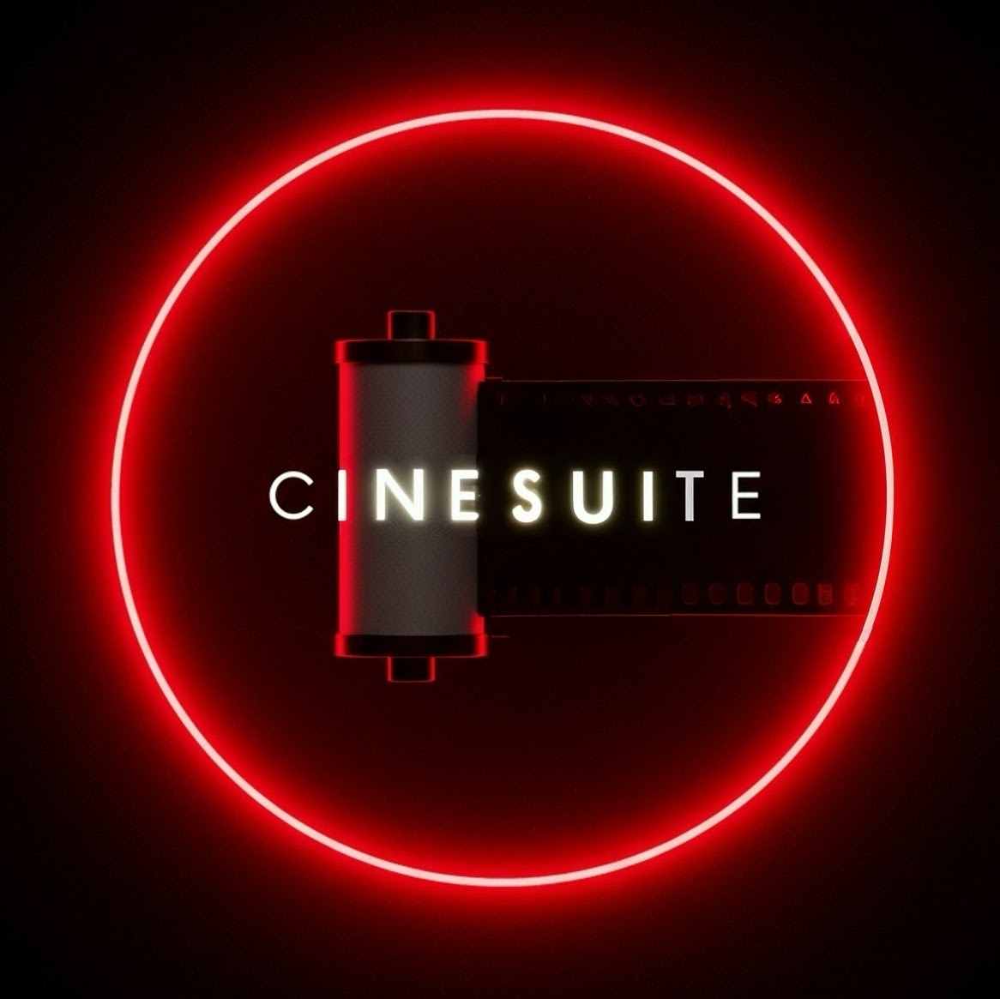

<p align="center">
  
</p>

# 🎞️ CineSuite - All-in-one Windows/MacOS app to get the Cinestill look

CineSuite is a free and open-source **Python-based photo effects app** that lets you add realistic **vintage/film-style effects** to your images. Whether you're recreating the iconic Cinestill **halation glow**, adding **film grain, dust, light leaks**, or giving your photos a **classic film border**, CineSuite gives you full control with many adjustable settings.  

## ✨ Key Features  
- **Cinestill Halation** – Recreate the red glow effect seen in Cinestill film.  
- **Film Grain** – Simulate fine or coarse, monochromatic or color film grain for a realistic analog look.
- **Film Borders** – Add authentic 35mm and medium-format film borders, as well as basic color borders.  
- **Light Leaks & Vignetting** – Introduce artistic light flares and darkened edges.  
- **Synthetically Generated Dust** – No overlays! Dust and hair particles are **algorithmically generated** in a super-realistic way.  
- **Color Fringing** – Subtle chromatic aberrations for extra realism.  
- **Batch Processing** – Apply effects to an entire folder of images with one click.  

## 🖥️ Download  
- **Windows (.exe)**: [Download here](https://github.com/wavequant/cinesuite/releases/download/release/CineSuite_Windows.zip)  
- **Mac (.app)**: [Download here, READ BELOW HOW TO RUN](https://github.com/wavequant/cinesuite/releases/download/release/CineSuite_MacOS.zip)  
*(Links also available in the Releases section.)*

**IMPORTANT FOR MACOS USERS**: Before first-time use, you have to run the script "run_cinesuite.sh" in order to run an un-signed app, as I don't have an Apple Developer account to sign it properly, so you won't be able to run the app (it will say it's damaged) without first running the script. After that, you can open the app without a problem. In order to run the script before first-time use, open your terminal, navigate to the folder where you extracted the zip, and type "bash run_cinesuite.sh".

## 📸 How It Works  
1. Open CineSuite and load your images.  
2. Use the toggles and sliders to fine-tune each effect.   
3. Save your beautifully processed film-like photos! (Don't forget to share and mention us)

## 📂 Installation & Running from Source  
If you prefer to run CineSuite from source, create your environment, install dependencies and start the app:  
```sh
pip install -r requirements.txt
python app.py
```

## 📜 License
CineSuite is licensed under the MIT License – free to use and modify!
